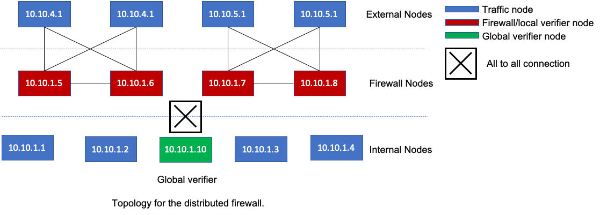

# Experiment setup and settings for distributed firewall

The setup file  `aaragog/Setup/setup.sh ` install ip route rules and install the required software on each machine. IP route rules enable us to overlay the topology given below over the star topology. Comments are added to the setup file as well.

After running the setup, Our topology looks like this:

We have four external nodes, four internal hnodes on a single LAN, and four firewall nodes interposing between the two groups.  
The firewalls are configured as two high-availability groups with two primaries and two hot standbys (backups).  
Each primary-standby group shares a virtual IP with the VRRP protocol.  
We base the traffic between external nodes and internal nodes on the traces provided in [DCTCP](https://github.com/NofelYaseen/TrafficGenerator).  

The rules for firewall are simple.  
Internal nodes can communicate with each other and initiate connection to external nodes.  
External nodes cannot initiate connection to internal nodes.

Firewall node are also running the verifier that allows filter and suppression.
Global verifier node is running Apache Kafka and Apache Flink.
Kafka is reponsible to receive and pipeline the events from the all the local verifers.  
Flink is running the global verifier. Flink allows us to scale up to more machines and provide fault tolerance.

